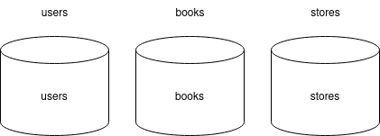
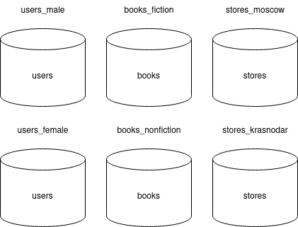
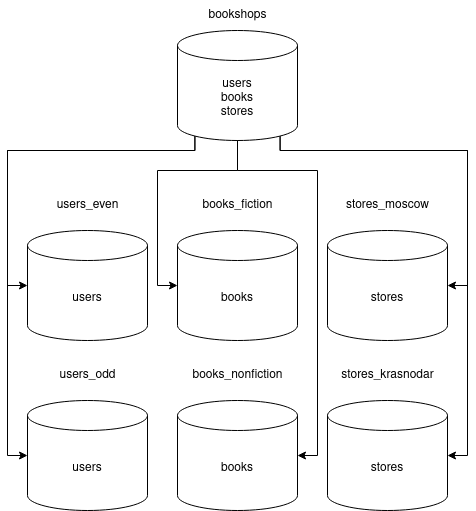

# Домашнее задание к занятию «Репликация и масштабирование. Часть 2» "макарцев Александр Владимирович"

### Задание 1

Опишите основные преимущества использования масштабирования методами:

- активный master-сервер и пассивный репликационный slave-сервер; 
- master-сервер и несколько slave-серверов;
- активный сервер со специальным механизмом репликации — distributed replicated block device (DRBD);
- SAN-кластер.

*Дайте ответ в свободной форме.*

#### Решение
- активный master-сервер и пассивный репликационный slave-сервер;
    - репликация
    - резервирование в базовом виде
    - распределение нагрузки чтения на два сервера
- master-сервер и несколько slave-серверов;
    - лучшее распределение нагрузки, чем в варианте выше
    - лучше отказоустойчивость, чем в варианте выше
    - есть возможность реализовать партицирование или шардинг
- активный сервер со специальным механизмом репликации — distributed replicated block device (DRBD);
    - позволяет копировать, дублировать данные с локального хранилища на удаленное
    - реализован на уровне ядра Linux, как модуль
    - приложение не знает, что данные реплицируются (таким образом, реализация не сильно зависит от используемого решения)
- SAN-кластер;
    - есть возможность создать сеть устройств, нагрузку на которые распределит самостоятельно
    - может хранить большой объём данных за счёт возможности выноса не часто используемых данных на медленном ленточном хранилище
    - надежность, как основной принцип

---

### Задание 2

Разработайте план для выполнения горизонтального и вертикального шаринга базы данных. База данных состоит из трёх таблиц: 

- пользователи, 
- книги, 
- магазины (столбцы произвольно). 

Опишите принципы построения системы и их разграничение или разбивку между базами данных.

*Пришлите блоксхему, где и что будет располагаться. Опишите, в каких режимах будут работать сервера.* 

#### Решение
Допустим таблицы будут содержать следующую информацию:

| users | books | stores |
| --- | --- | --- |
| id | id | id |
| login | title | name |
| username | author | city |
| gender | genre | - |

Для вертикального шардирования расделяем одну базу на три (по одной на каждую таблицу):

Будет три инстанса с базой данных (users, books, stores). На каждой БД будет по одной одноимённой таблице.

---

Для горизонтального шардирования каждую БД можно разбить ещё по какому-либо признаку. Например:
- Книги - по жанру
- Магазины - по городу
- Пользователи - по половой принадлежности

В указанных БД структура таблиц повторяет друг друга. БД находятся на разных инстансах и по факту не зависят друг от друга. Сведение данных в одну таблицу полностью лежит на приложении, которое взаимодействует с такой БД

---

Другой вариант, когда есть один общий сервер, который содержит все таблицы, которые заполняют и вычитывают данные из наследующих таблиц, находящихся на других серверах:

## Дополнительные задания (со звёздочкой*)
Эти задания дополнительные, то есть не обязательные к выполнению, и никак не повлияют на получение вами зачёта по этому домашнему заданию. Вы можете их выполнить, если хотите глубже шире разобраться в материале.

---
### Задание 3*

Выполните настройку выбранных методов шардинга из задания 2.

*Пришлите конфиг Docker и SQL скрипт с командами для базы данных*.